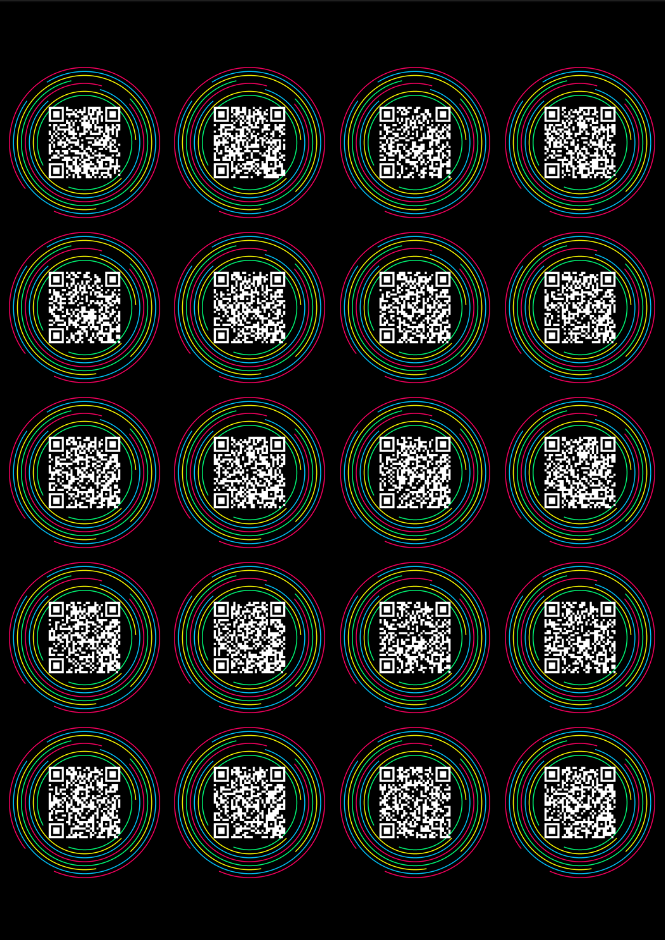
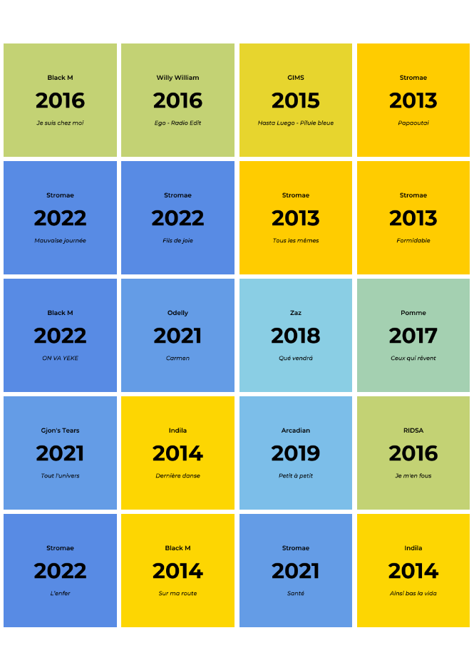

# Hitster Card Generator 🎵

**Generate custom Hitster-style music game cards from any Spotify playlist!**

Turn your favorite playlists into a physical card game. This tool creates professional-looking cards with neon QR codes for scanning and date-based colored solution backs. It automatically handles the layout for double-sided printing.

## 👀 Preview

The script generates a PDF optimized for duplex printing (the backs are mirrored so they align perfectly when cut).

| **Page 1: Front (Scan to Play)** | **Page 2: Back (Solutions)** |
|:---:|:---:|
|  |  |
| *Neon rings with Spotify QR codes* | *Year-based color gradients (Purple=Oldest, Blue=Newest)* |

---

## ✨ Features

- **Neon Design:** Generates QR codes with a randomized neon ring aesthetic.
- **Smart Timeline Colors:** Solution cards use a dynamic color gradient (Purple → Pink → Gold → Blue) representing the release year relative to the other songs in the playlist.
- **Print Ready:** Outputs a standard A4 PDF with 5x5cm cards in a 4x5 grid layout.
- **Duplex Optimized:** Automatically generates alternating pages with mirrored layouts for accurate double-sided printing.
- **Spotify Integration:** Fetches song metadata (Artist, Title, Year) and Spotify Links automatically using the Spotify Web API.


## Prerequisites

- Python 3.7+
- Spotify Developer Account (free)

## Installation

1. **Clone this repository:**
   ```bash
   git clone https://github.com/WhiteShunpo/hitster-card-generator.git
   cd hitster-card-generator
   ```

2. **Install dependencies:**
   ```bash
   pip install -r requirements.txt
   ```

3. **Install Montserrat fonts (recommended for authentic Hitster look):**
   
   **Linux/Mac:**
   ```bash
   git clone https://github.com/JulietaUla/Montserrat.git /tmp/Montserrat
   mkdir -p ~/.fonts
   cp /tmp/Montserrat/fonts/ttf/*.ttf ~/.fonts/
   fc-cache -f
   ```
   
   **Windows:**
   - Download fonts from [Google Fonts](https://fonts.google.com/specimen/Montserrat)
   - Install: Bold, SemiBold, and Medium Italic variants

   *Note: If fonts aren't installed, the script will fall back to system fonts.*

## Setup Spotify API Credentials

1. **Go to [Spotify Developer Dashboard](https://developer.spotify.com/dashboard)**

2. **Log in with your Spotify account** (or create one)

3. **Create an app:**
   - Click "Create app"
   - App name: `Hitster Card Generator` (or any name)
   - App description: `Generate game cards from playlists`
   - Redirect URI: `https://localhost` (required but not used)
   - Check "Web API"
   - Click "Save"

4. **Get your credentials:**
   - On your app page, click "Settings"
   - Copy your **Client ID**
   - Click "View client secret" and copy your **Client Secret**

## Usage

### Method 1: Edit the script directly

Open `hitster_card_creator.py` and replace the placeholders:

```python
PLAYLIST_URL = "your_spotify_playlist_url_here"
CLIENT_ID = "your_client_id_here"
CLIENT_SECRET = "your_client_secret_here"
```

Then run:
```bash
python hitster_card_creator.py
```

### Method 2: Import as a module

```python
from hitster_card_creator import generate_hitster_cards

generate_hitster_cards(
    playlist_url="https://open.spotify.com/playlist/YOUR_PLAYLIST_ID",
    client_id="your_client_id",
    client_secret="your_client_secret",
    output_dir="my_cards"
)
```

## 🔧 Accuracy Fix (Incorrect Years)

Spotify often provides "Remaster" or "Greatest Hits" years (e.g., 2011) instead of the original release date. To fix this:

1.  Run the script once. It will save `hitster_cards/songs.json`.
2.  Open `songs.json` or paste it into ChatGPT/Gemini with this prompt:
    > "Correct the years in this JSON to the original single release dates. Return valid JSON."
3.  Save the corrected file back to `hitster_cards/songs.json`.
4.  Run the script again. It will use your corrected local file instead of Spotify data.

## Output

The script generates:
- **Card images:** `hitster_cards/card_001_qr.png`, `card_001_solution.png`, etc.
- **Print-ready PDF:** `hitster_cards.pdf`

### PDF Layout
- **Page 1:** Cards 1-20 (QR fronts, black background)
- **Page 2:** Cards 1-20 (Solution backs, white background, mirrored for duplex)
- **Page 3:** Cards 21-40 (QR fronts)
- **Page 4:** Cards 21-40 (Solution backs)
- And so on...

## Printing Instructions

1. Print the PDF double-sided (flip on long edge)
2. Cut along the gaps (2mm spacing between cards)
3. Each card should be 5cm x 5cm

## Customization

### Change color gradient
Edit the `COLOR_GRADIENT` list in the script:
```python
COLOR_GRADIENT = [
    "#7030A0",  # Purple (oldest)
    "#4169E1",  # Blue (newest)
]
```

### Adjust card layout
Modify these variables:
```python
cards_per_row = 4
cards_per_col = 5
card_size = 5 * cm
gap_size = 0.2 * cm
```

## Troubleshooting

**"Module not found" error:**
```bash
pip install -r requirements.txt
```

**Fonts not working:**
- Install Montserrat fonts (see Installation step 3)
- Or edit `FONT_PATHS` in the script to point to your fonts

**"Playlist not found" (404 error):**
- Make sure your playlist is **public** (Spotify API can't access private playlists with client credentials)

**QR codes not scanning:**
- Ensure printer settings: "Actual size" (not "Fit to page")
- Print at high quality/resolution

## License

MIT License - Feel free to use and modify!

## Credits

- Inspired by the original [Hitster game](https://www.jumbodiset.com/hitster)
- Montserrat font by [Julieta Ulanovsky](https://github.com/JulietaUla/Montserrat)

## Contributing

Pull requests welcome! Feel free to:
- Add new card designs
- Improve font handling
- Add command-line interface
- Support other music platforms

---


