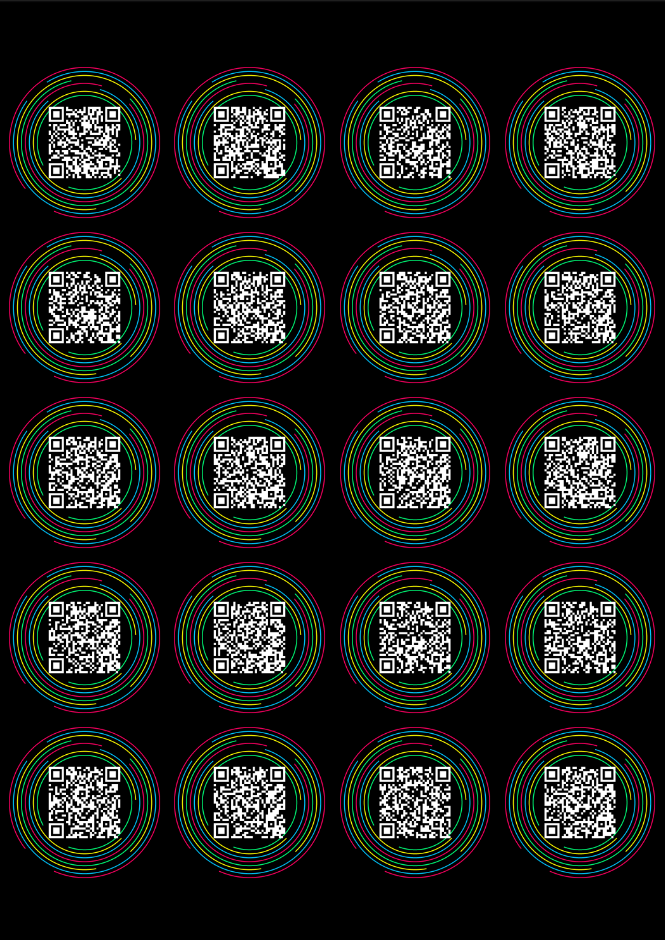
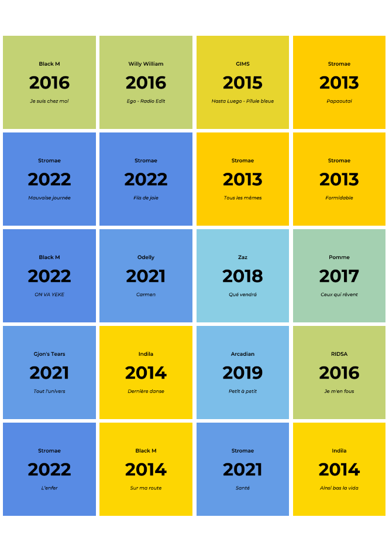

# Hitster Card Generator 🎵

[](https://www.buymeacoffee.com/WhiteShunpo)
[](https://hitster-card-generator.streamlit.app/)

**Generate custom Hitster-style music game cards from any Spotify playlist!**

Turn your favorite playlists into a physical card game. The tool creates professional cards with neon QR codes on the front and year-based coloured solution backs. It outputs a print-ready, duplex-optimised A4 PDF.

> [!IMPORTANT]
> **2026 API Update:** Spotify has temporarily disabled "Create App" for new developer accounts.
> **No API key? No problem.** The web app and the CLI scraper both work without one.

---

## 👀 Preview

| **Front (Scan to Play)** | **Back (Solutions)** |
|:---:|:---:|
|  |  |
| *Randomised neon rings + Spotify QR* | *Year-based colour gradient (Purple → Blue)* |

---

## ✨ Features

| Feature | Details |
|---|---|
| 🌐 **Web Interface** | [Streamlit app](https://hitster-card-generator.streamlit.app/) — paste links, review, download |
| 🔗 **No API Key Required** | Scrapes public Spotify pages; works with individual tracks *or* playlist URLs |
| 📋 **Playlist URL Support** | Paste a single playlist URL to import up to ~100 tracks (unlimited with API credentials) |
| ✏️ **Manual Year Override** | Edit years in an interactive table before generating the PDF |
| 🎨 **Neon QR Design** | Unique randomised neon rings on every card |
| 🎯 **Smart Colours** | Dynamic gradient (Purple → Pink → Gold → Blue) mapped to release years |
| 🖨️ **Print-Ready PDF** | A4, 5 × 5 cm cards, 20 per page, duplex-optimised |
| 💡 **Ink Saving Mode** | White background / black text toggle |
| ✂️ **Cutting Borders** | Optional border lines for easier cutting |
| 🏷️ **Card Labels** | Stamp each card with a custom label (event name, playlist, etc.) |
| 🎨 **Deep Customization** | Customize background colors, neon rings, QR styles, and game titles |
| 🖼️ **Custom Backgrounds** | Upload your own images to use as card backgrounds |
| 📱 **Scan-Safe QR** | Choose between transparent or solid QR backgrounds for 100% scan reliability |
| 🔤 **Game Titles** | Add custom game titles at various positions (top, bottom, vertical, etc.) |

---

## 🎨 Card Customization

You can now fully customize the look and feel of your cards in the **sidebar** of the web app:

### 📱 QR Side Design
- **Background Type:** Choose between `Neon Rings`, `Solid Color`, or `Custom Image`.
- **Neon Rings:** Adjust thickness, color palette, and ring count.
- **QR Background Mode:** 
  - `Transparent`: Classic look, neon rings show through the QR code.
  - `Solid`: Draws a backplate (square or rounded) behind the QR code for maximum scan reliability.
- **QR Colors:** Customize module and backplate colors.
- **QR Size:** Scale the QR code up or down.

### 🔤 Game Titles & Labels
- **Game Title:** Add a custom text like "90s Party" or "Wedding 2026".
- **Positioning:** Place the title at the top, bottom, or vertically on the sides.
- **Styling:** Adjust font size, color, and background boxes for better readability.

### 🖼️ Custom Background Image
1. Select **Background Type: Image** in the sidebar.
2. Upload a square image (recommended: 2000x2000px).
3. The image will be automatically cropped and resized to fit the card.
4. **Pro Tip:** Use **Solid QR Background Mode** when using busy image backgrounds to ensure the QR code remains scannable.

---

## 🚀 Quick Start

### Option A — Web App (easiest)

👉 **<https://hitster-card-generator.streamlit.app/>**

1. **Copy links** — In Spotify Desktop, open your playlist, select songs (`Ctrl+A`), copy (`Ctrl+C`).
2. **Paste** — Drop them into the text area (individual track links *or* a single playlist URL).
3. **Review** — Check the metadata table and fix any wrong years.
4. **Download** — Click **Create My PDF** and print double-sided.

### Option B — Local CLI

```bash
git clone https://github.com/WhiteShunpo/hitster-card-generator.git
cd hitster-card-generator
pip install -r requirements.txt
```

**Scraper mode (no API key):**

1. Collect links from Spotify Desktop (`Ctrl+A` → `Ctrl+C`).
2. Save them in a file called `links.txt` in the project root.
3. Run:

```bash
python src/hitster_card_creator.py
# With options:
python src/hitster_card_creator.py --ink-save-mode --card-draw-border --card-label "Game Night"
# With custom styling options:
python src/hitster_card_creator.py --qr-bg-mode solid --game-title "Hits"
```

**API mode** (if you have Spotify credentials):

```bash
cp .env.example .env
# Fill in CLIENT_ID, CLIENT_SECRET, PLAYLIST_URL
python src/hitster_card_creator.py
```

---

## ⚙️ Configuration

All options can be set via the **sidebar** in the web app, via **CLI flags**, or in the `.env` file.

| Setting | CLI flag | `.env` variable | Default |
|---|---|---|---|
| Ink saving mode | `--ink-save-mode` | `INK_SAVING_MODE=true` | `false` |
| Cutting borders | `--card-draw-border` | `CARD_DRAW_BORDER=true` | `false` |
| Card label | `--card-label "text"` | `CARD_LABEL=text` | *(none)* |
| QR Background Mode | `--qr-bg-mode` | `QR_BG_MODE=solid` | `transparent` |
| QR Module Color | `--qr-module-color` | `QR_MODULE_COLOR=#FFFFFF` | `#000000` |
| Background Type | `--bg-type` | `BG_TYPE=neon_rings` | `neon_rings` |
| Game Title | `--game-title` | `GAME_TITLE=MyGame` | *(none)* |

### Colour gradient

Edit the `COLOR_GRADIENT` list in the config section of `src/hitster_card_creator.py`:

```python
COLOR_GRADIENT = [
    "#7030A0",  # Purple (oldest)
    "#E31C79",  # Pink
    "#FF6B9D",  # Light pink
    "#FFA500",  # Orange
    "#FFD700",  # Gold
    "#87CEEB",  # Sky blue
    "#4169E1",  # Royal blue (newest)
]
```

---

## 🔑 Spotify API Credentials (optional)

Only needed if you want to fetch playlists larger than ~100 tracks via the API.

1. Go to the [Spotify Developer Dashboard](https://developer.spotify.com/dashboard).
2. Create an app (Redirect URI: `https://localhost`, check **Web API**).
3. Copy **Client ID** and **Client Secret**.
4. Enter them in the web app sidebar *or* add them to your `.env` file.

---

## 🔧 Fixing Incorrect Years

Spotify metadata sometimes shows remaster/re-release years instead of the original.

**Web app:** Edit the **Year** column directly in the review table.

**CLI:**

1. Run the script once — it saves `output/hitster_cards/songs.json`.
2. Fix years in the JSON manually, or paste it into ChatGPT / Gemini:
   > *"Correct the years in this JSON to the original single release dates. Return valid JSON."*
3. Run again (without `--fetch`) to use the corrected file.

---

## 📂 Output

| File | Description |
|---|---|
| `output/hitster_cards/card_NNN_qr.png` | QR-side card images |
| `output/hitster_cards/card_NNN_solution.png` | Solution-side card images |
| `output/hitster_cards/songs.json` | Song metadata (editable) |
| `output/hitster_cards.pdf` | Print-ready PDF |

---

## 🖨️ Printing Instructions

1. Print the PDF **double-sided** (flip on long edge).
2. Cut along the gaps (2 mm spacing).
3. Each card is **5 × 5 cm**.

> **Tip:** Use "Actual size" in your printer settings (not "Fit to page") so QR codes scan correctly.

---

## 🐛 Troubleshooting

| Problem | Fix |
|---|---|
| `ModuleNotFoundError` | `pip install -r requirements.txt` |
| Playlist not found (404) | Make sure the playlist is **public** |
| QR codes won't scan | Print at "Actual size", high quality |
| Download button unresponsive on mobile | Try a desktop browser |

---

## 🤝 Contributing

Pull requests welcome! Ideas:

- New card designs / themes
- Support for other music platforms (Apple Music, YouTube Music)
- Improved year accuracy heuristics

---

## 🤝 Contributors

A huge thanks to the following people for helping make this project better:

- **[cdaller](https://github.com/cdaller)** — Ink-saving mode, improved QR code logic, enhanced year accuracy.

---

## 📜 License

MIT License — see [LICENSE](LICENSE).

## Credits

- Inspired by the original [Hitster game](https://www.jumbodiset.com/hitster)
- [Montserrat](https://github.com/JulietaUla/Montserrat) font by Julieta Ulanovsky
